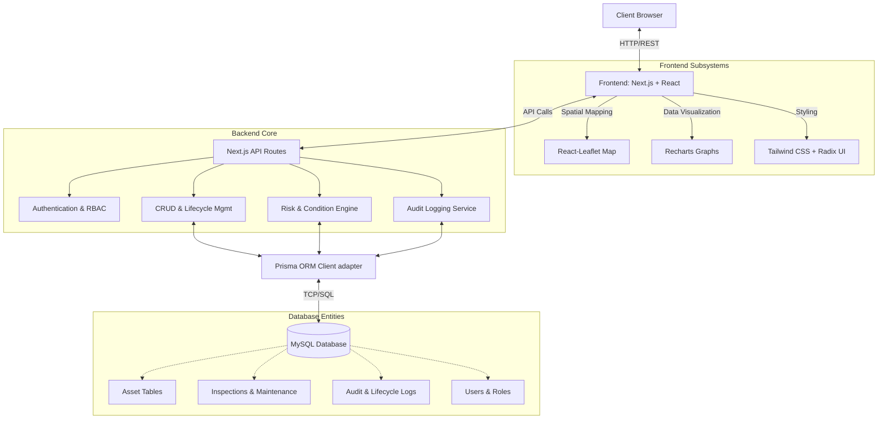

# InfraGov - Government Infrastructure Asset Lifecycle Platform

InfraGov is a state-of-the-art government infrastructure asset management prototype designed to track, manage, and audit public infrastructure resources (roads, bridges, water supply, lighting, public buildings, etc.) throughout their entire lifecycle. Built for an 8-hour university hiring hackathon.

## Key Features
- **Asset Registry**: Centralized inventory of all government infrastructure.
- **Progressive Creation Wizard**: 7-step wizard to register complex municipal assets without manual intervention.
- **GIS Interactive Map**: Real-time Leaflet spatial map displaying asset locations color-coded by physical condition and risk severity.
- **Risk & Condition Engine**: Transparent risk calculations factoring in physical health, operational status, failure history, and criticality.
- **Inspections & Maintenance Log**: Monitor and evaluate condition assessments and execute maintenance work orders.
- **Audit Logging**: Robust append-only timeline trail for transparent lifecycle events.
- **Executive Dashboard**: Command center view with actionable KPI metrics, active alerts, and data distribution charts.
- **Operations Center**: Task queue for handling critical alerts and assigning work orders.

## System Architecture



## Tech Stack
- **Framework**: Next.js 16 (App Router)
- **Language**: TypeScript
- **Database**: MySQL
- **ORM**: Prisma
- **Styling**: Tailwind CSS
- **Mapping**: Leaflet / React-Leaflet
- **Charts**: Recharts
- **Validation**: Zod

## Getting Started

### Prerequisites
- Node.js (v18+)
- Local MySQL instance running on port 3306

### Local Installation
1. Clone the repository
2. Navigate to the `infragov` directory: 
   ```bash
   cd infragov
   ```
3. Install dependencies:
   ```bash
   npm install
   ```
4. Setup environment variables (copy `.env.example` if available, or ensure local `.env` is setup for MySQL):
   ```bash
   # .env
   DATABASE_URL="mysql://root:@localhost:3306/infragov"
   ```
5. Synchronize Prisma schema to database:
   ```bash
   npx prisma db push
   ```
6. Seed database with real-world infrastructure data (165 assets):
   ```bash
   npm run db:seed
   ```
7. Run the development server:
   ```bash
   npm run dev
   ```

### Demo Logins (if applicable)
- Admin: `admin@govdemo.local` / `demo123`
- Inspector: `inspector@govdemo.local` / `demo123`
